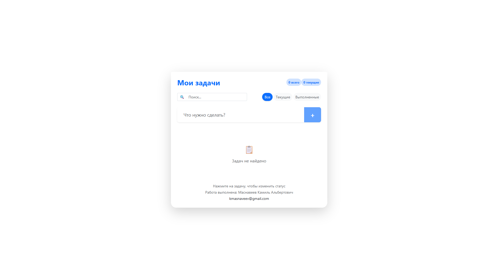

# 📝 React Todo GAO



---

## 🇷🇺 Русский (Russian)

### Описание
Современное и производительное приложение для управления списком задач, разработанное с использованием React, Redux Toolkit и Vite. Проект ориентирован на масштабируемость, чистоту кода и автоматизацию CI/CD.

### Ключевые возможности
- **Умная фильтрация**: Фильтрация задач по категориям (Все, Текущие, Выполненные).
- **Поиск в реальном времени**: Мгновенный поиск задач по тексту.
- **Современный UI**: Центрированный интерфейс на базе Bootstrap 5 с акцентом на UX.
- **Надежность**: Весь основной функционал и логика хранилища покрыты тестами (Vitest).
- **CI/CD**: Полная автоматизация деплоя на GitHub Pages и прохождения тестов при каждом пуше.

### Технологический стек
- **Frontend**: React 19, Redux Toolkit, Bootstrap 5.
- **Инструменты**: Vite, ESLint.
- **Тестирование**: Vitest, React Testing Library, JSDOM.
- **DevOps**: Docker (Multi-stage build), GitHub Actions.

### Как запустить
1. **Локально**:
   ```bash
   npm install
   npm run dev
   ```
2. **Тесты**:
   ```bash
   npm test
   ```
3. **Docker**:
   ```bash
   docker compose up --build
   ```

---

## 🇺🇸 English

### Description
A modern, high-performance task management application built with React, Redux Toolkit, and Vite. This project focuses on scalability, clean code, and CI/CD automation.

### Key Features
- **Smart Filtering**: Category-based task filtering (All, Active, Completed).
- **Real-time Search**: Instant task search by text.
- **Modern UI**: Centered Bootstrap 5-based interface with a strong focus on UX.
- **Reliability**: All core functionality and store logic are covered by tests (Vitest).
- **CI/CD**: Full automation for GitHub Pages deployment and test execution on every push.

### Tech Stack
- **Frontend**: React 19, Redux Toolkit, Bootstrap 5.
- **Tooling**: Vite, ESLint.
- **Testing**: Vitest, React Testing Library, JSDOM.
- **DevOps**: Docker (Multi-stage build), GitHub Actions.

### Getting Started
1. **Locally**:
   ```bash
   npm install
   npm run dev
   ```
2. **Testing**:
   ```bash
   npm test
   ```
3. **Docker**:
   ```bash
   docker compose up --build
   ```

---

**Работа выполнена: Маснавеев Камиль Альбертович**  
**Email:** [kmasnaveev@gmail.com](mailto:kmasnaveev@gmail.com)
